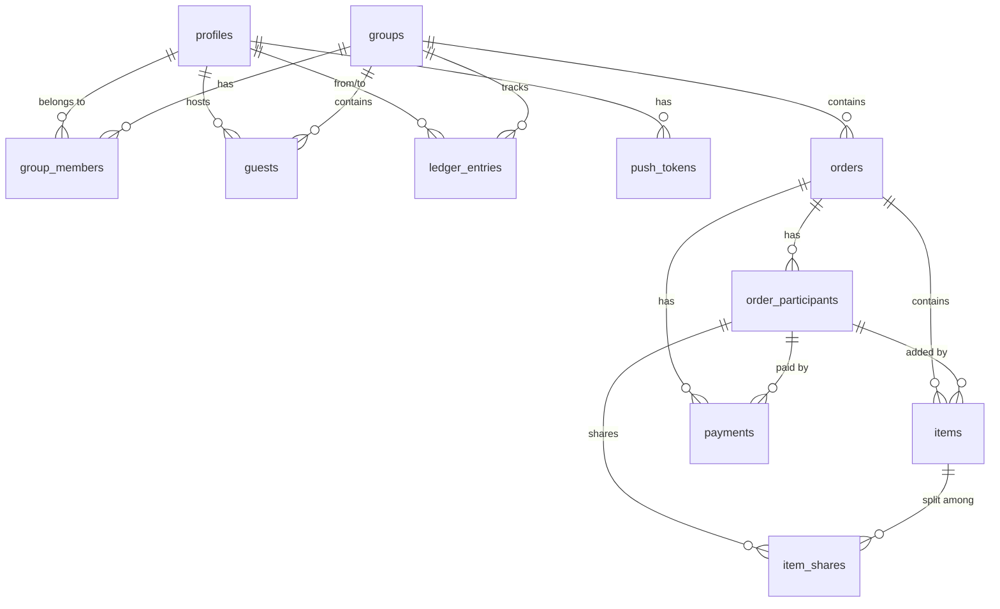

# Database Schema

## ER Diagram

## Tables

### profiles
Extends `auth.users`. Auto-created via trigger.
- `id` (uuid, PK, FK → auth.users)
- `display_name` (text)
- `avatar_url` (text, nullable)
- `phone` (text, nullable)
- `created_at`, `updated_at`

### groups
- `id` (uuid, PK)
- `name` (text)
- `description` (text, nullable)
- `invite_code` (text, unique) — auto-generated hex
- `currency` (text, default 'EGP')
- `created_by` (uuid, FK → profiles)

### group_members
- `group_id` + `user_id` (unique pair)
- `role` ('admin' | 'member')

### guests
Temporary participants linked to a host user.
- `name`, `host_user_id`, `group_id`
- `claimed_by` (nullable, for future guest-to-user migration)

### orders
- `status`: 'open' → 'locked' → 'finalized' → 'settled'
- `actual_total`, `tax`, `tip`, `discount` — filled at finalization

### order_participants
- Either `user_id` OR `guest_id` (CHECK constraint)
- `is_included` — toggle for split inclusion

### items
- `price` nullable (filled at finalization)
- `is_shared` — if true, split among all participants
- `added_by_participant_id`

### item_shares
- `share_fraction` (numeric, default 1.0) — for future custom splits

### payments
- Records who paid and how much
- `participant_id` links to order_participants

### ledger_entries
- `from_user_id` (debtor) → `to_user_id` (creditor)
- `type`: 'order_debt' | 'guest_transfer' | 'settlement'
- Persistent across all orders

### group_balances (VIEW)
Aggregates ledger_entries by group/from/to.

## Migrations
- `00001_initial_schema.sql` — All tables + triggers + indexes
- `00002_rls_policies.sql` — All RLS policies
