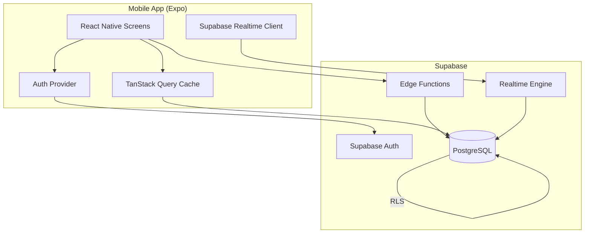

# Architecture Overview

## High-Level Architecture

## Key Architecture Decisions

| Decision | Choice | Rationale |
|----------|--------|-----------|
| Routing | Expo Router (file-based) | Built into Expo SDK, typed routes |
| Backend | Supabase | Single platform: Auth + DB + Realtime + Edge Functions |
| State | TanStack Query + Realtime | Query for caching; Realtime invalidates (no parallel state) |
| Calculations | Client preview + Edge Function finalization | Instant UX + atomic writes |
| Guests | DB rows linked to host | Debt transfers at finalization |
| Settlement | Greedy algorithm | O(n log n), near-optimal for small groups |

## Data Flow

1. **Reading data**: Screen → TanStack Query → Supabase client → PostgreSQL (with RLS)
2. **Writing data**: Screen → Mutation → Supabase client → PostgreSQL → Invalidate cache
3. **Real-time**: PostgreSQL change → Realtime engine → Client subscription → Invalidate TanStack cache
4. **Finalization**: Screen → Edge Function → PostgreSQL transaction (atomic)

See [[database-schema]] for full schema details.
See [[state-management]] for query key patterns.
